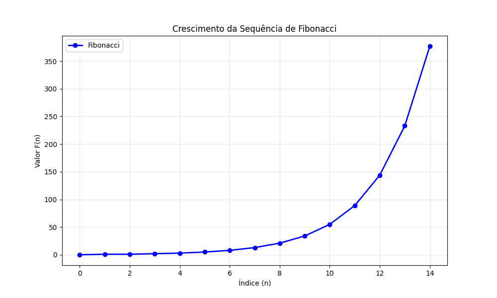
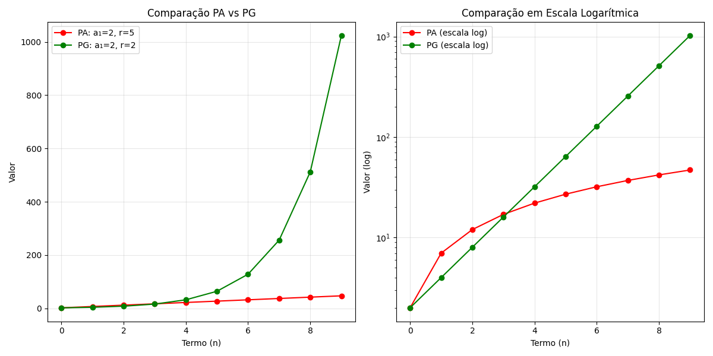
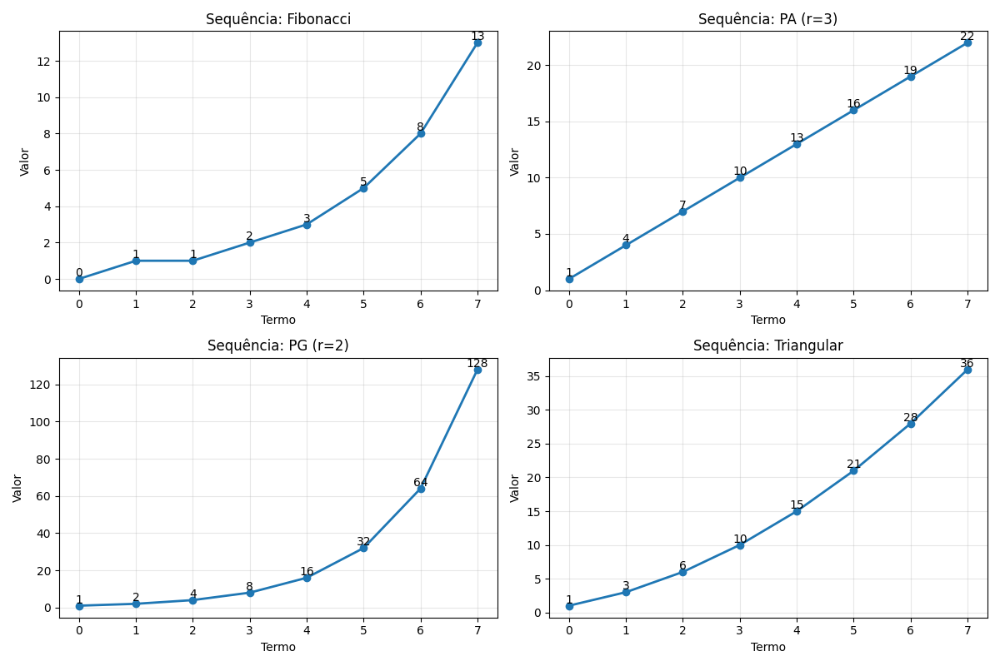

# 🧮 Computational Math Foundations


[](https://www.python.org/)
[](https://opensource.org/licenses/MIT)

Um projeto educacional que implementa conceitos matemáticos fundamentais do zero, conectando teoria abstrata com aplicações computacionais práticas.

## 🎯 Objetivo

Demonstrar como conceitos matemáticos abstratos podem ser implementados computacionalmente, desenvolvendo:
- **Operações matemáticas básicas** a partir de princípios fundamentais
- **Sequências matemáticas** clássicas e suas propriedades
- **Visualizações** que ilustram o comportamento matemático
- **Testes unitários** que validam a correção dos algoritmos

## 📁 Estrutura do Projeto

```
computational-math-foundations/
├── src/                    # Código fonte principal
│   ├── basic_operations.py # Operações fundamentais
│   └── number_sequences.py # Sequências matemáticas
├── tests/                  # Testes unitários
│   ├── test_operations.py
│   └── test_sequences.py
├── examples/               # Demonstrações e visualizações
│   └── visualize_sequences.py
├── docs/                   # Documentação e imagens
│   ├── math_concepts.md
│   ├── fibonacci_growth.png
│   ├── sequence_comparison.png
│   └── multiple_sequences.png
└── README.md
```

## 🚀 Como Executar

### Pré-requisitos
- Python 3.8 ou superior
- pip (gerenciador de pacotes Python)

### Instalação

1. **Clone o repositório:**
```bash
git clone https://github.com/StevenSantosGuimaraes/computational-math-foundations.git
cd computational-math-foundations
```

2. **Instale as dependências:**
```bash
pip install matplotlib
```

### Execução dos Módulos

#### 🧪 Testes Unitários
```bash
# Executar todos os testes
python tests/test_operations.py
python tests/test_sequences.py
```

#### 📊 Visualizações
```bash
# Gerar gráficos das sequências matemáticas
python examples/visualize_sequences.py
```

#### 💻 Uso Direto das Funções
```python
from src.basic_operations import add, multiply, factorial
from src.number_sequences import fibonacci_sequence, arithmetic_sequence

print(f"Soma: {add(5, 3)}")                    # 8
print(f"Fatorial: {factorial(5)}")             # 120
print(f"Fibonacci: {fibonacci_sequence(6)}")   # [0, 1, 1, 2, 3, 5]
```

## 📚 Conceitos Matemáticos Implementados

### Operações Fundamentais
- **🔢 Adição** - Implementada via incrementos sucessivos
- **✖️ Multiplicação** - Como adição repetida  
- **⚡ Potenciação** - Como multiplicação repetida
- **📈 Fatorial** - Base para combinatória e probabilidade

### Sequências Matemáticas
- **🐇 Fibonacci** - Crescimento exponencial e razão áurea
- **📐 Progressão Aritmética** - Crescimento linear
- **🚀 Progressão Geométrica** - Crescimento exponencial
- **🔺 Números Triangulares** - Soma de números naturais
- **🔢 Números Primos** - Fundamentos da teoria dos números

## 📊 Visualizações Geradas

### 1. Crescimento de Fibonacci


### 2. Comparação PA vs PG  


### 3. Múltiplas Sequências


## 🧠 Aprendizados Desenvolvidos

### Conceitos Matemáticos
- Fundamentos de aritmética computacional
- Propriedades de sequências numéricas
- Análise de crescimento (linear vs exponencial)
- Teoria básica de números

### Habilidades Computacionais
- Implementação de algoritmos matemáticos
- Desenvolvimento orientado a testes (TDD)
- Visualização de dados com matplotlib
- Estruturação de projetos Python

### Metodologia
- Abordagem "do zero" para compreensão profunda
- Conexão entre teoria abstrata e implementação prática
- Documentação como ferramenta de aprendizado

## 🔬 Exemplos de Aplicação

```python
from src.number_sequences import analyze_sequence

fib = fibonacci_sequence(10)
analysis = analyze_sequence(fib, "Fibonacci")
print(f"Soma dos termos: {analysis['sum']}")
print(f"Taxa de crescimento: {analysis['growth_rate']}")
```

## 🤝 Contribuindo

Contribuições são bem-vindas! Sinta-se à vontade para:
- Reportar issues
- Sugerir novos recursos
- Enviar pull requests

## 👨‍💻 Autor

**Steven Santos Guimarães**
- GitHub: [@StevenSantosGuimaraes](https://github.com/StevenSantosGuimaraes)

---

<div align="center">

**"A matemática é a linguagem com a qual Deus escreveu o universo."** - Galileo Galilei
</div>
